# Terminal Dice

[Play the game here](https://terminal-dice.herokuapp.com/)

**Terminal Dice** is a game of chance that mimics the popular casino game called Craps or Casino Dice. It runs in the Code Institute mock terminal on Heroku. The game involves rolling a pair of dice, and depending on the outcome, the player either wins or loses. The player must win the game on their first attempt, or they need to roll their point twice in a row to win. The game continues until the player decides to stop playing.
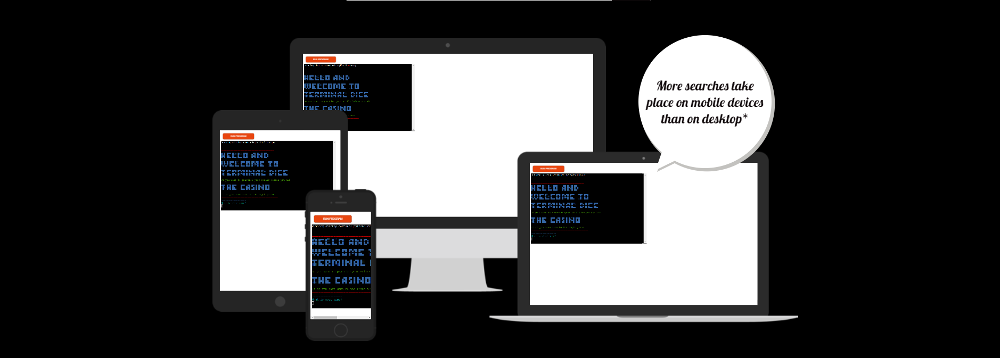

## Contents

* [How to play](#how-to-play)

* [Features](#features)
  * [Colour Scheme](#colour-scheme)
  * [Existing Features](#exisiting-features)
  * [Future Features](#future-features)

* [Testing](#testing)
  * [Validation](#validation)
  * [Manual Testing](#manual-testing)
  * [Bugs](#bugs)
  * [Remaning bugs](#remaining-bugs)

* [Deployment](#deployment)

* [Credits](#credits)
  * [Code Used](#code-used)
  * [Acknowledgments](#acknowledgments)  

# How to play

1. The player rolls the dice and the computer adds the numbers together.
2. If the total is 7 or 11 the player wins.
3. If the total is 2, 3, or 12, the player loses.
4. If the total is any other number 4, 5, 6, 8, 9, or 10 that number becomes the point.
5. The player then continues to roll the dice until they either roll the point again and win or they roll a 2, 3, 7, 11 or 12 and lose.

# Features

## Colour Scheme

I wanted to add some colour but with this project being in the terminal I thought I couldnt or would be limited and then I discovered [Colorama](https://pypi.org/project/colorama/).

* Red - Is used for the border of the welcome message and the border of the exit message. I also used Red in all error messages and anything that is considered negative.
* Green - Is used for anything considered postive and for game commands as in loading game, meeting age requirments etc.
* Blue - Is used for the welcome message and the end game message.
* Yellow - Is used for anything to do with the Dice. Dice rolling, telling you your score and the intructions.
* Cyan - Is used for asking questions as in your name, age, do you want to play etc.

## Exisiting Features

* When the game starts you get a welcome message which leads into asking you your name.
* 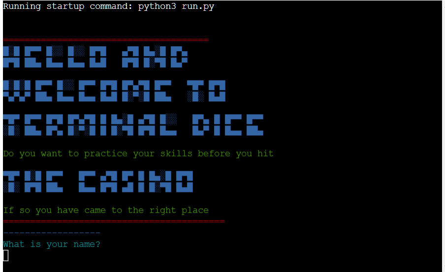

* After entering your name you will be asked your age you can only play if you are over 21.
* 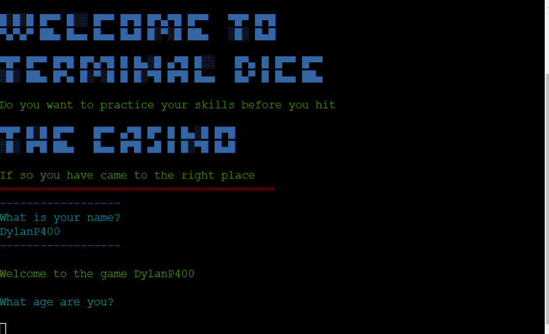

* If you are not old enough to play to game will exit and restart.
* 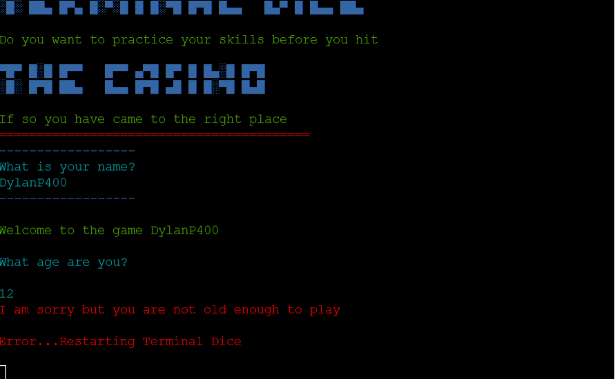

* After giving your age if you are old enough to play you will be asked if you know how to play.
* 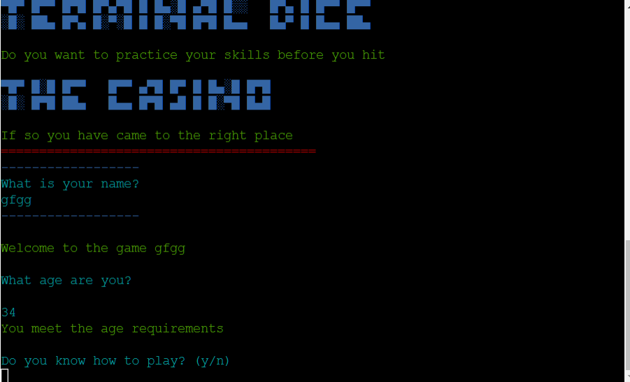

* If you clicked no it will take you to the instructions then it will ask you if you want to play.
* 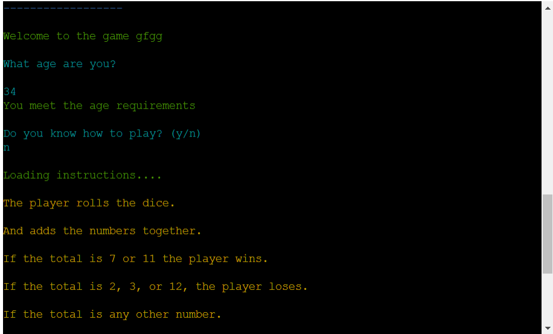
* 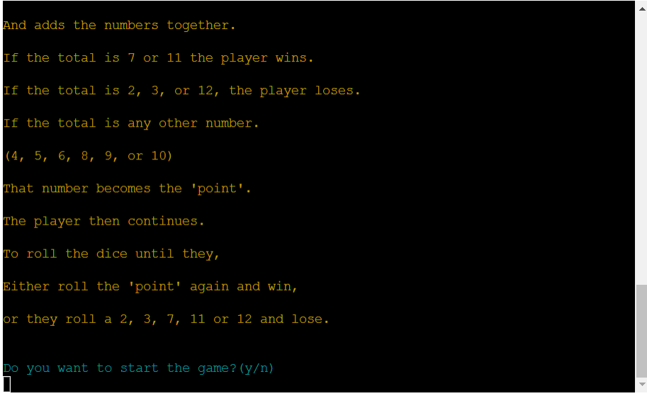

* After starting the game it will ask you to press 'r' to roll your dice.
* 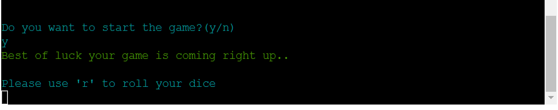

* When you enter 'r' the dice will print to the terminal and add the two dice together to give you your total.
* 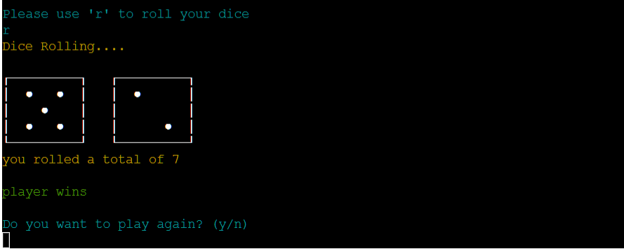

* If you dont win or lose on your first roll the game will continue to the point and continue until you hit your point again or lose.
* 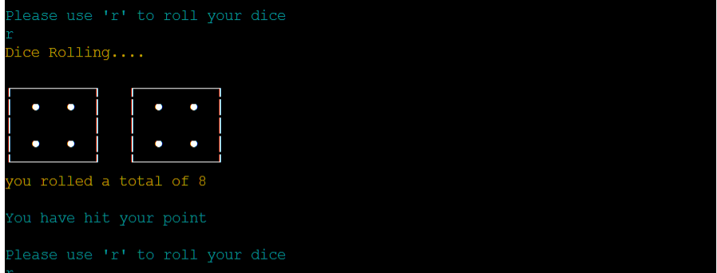
* 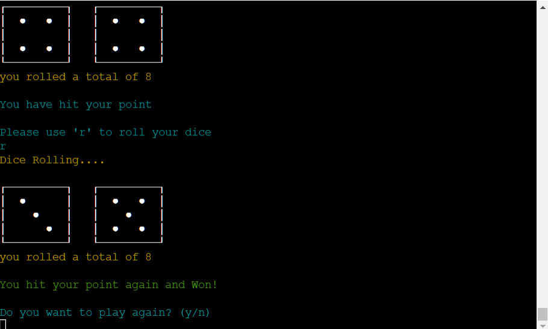

* Everytime you win or lose the game will ask if you want to play again.

* If you choose to exit the game it will bring you back to the welcome screen.
* 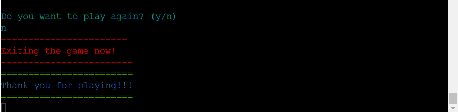

## Future Features

* It would be great to provide users with the ability to create their own accounts and save their names and scores. This feature can personalize the gaming experience, as players can keep track of their progress and compete against other players' high scores. Additionally, having a user account system can encourage players to return to the game and improve their scores over time.

* Game Variations By adding different variations of craps, such as Simplified Craps or High Point Craps, players can experience different rule sets and strategies, which can keep the game fresh and engaging over multiple play sessions.

* I think it would be a good idea to include a betting system in the game, so players can decide how much money to bet on each roll. This will add more excitement to the game and make it more replayable, as players can try different betting strategies to see which one works best.

* I could integrate more advanced statistics and metrics into the game, such as the average number of rolls per game or the most common point values rolled, to give players deeper insights into their gameplay and allow them to make more informed decisions.

* Along with the betting system I would like to implement a cash out system if the player is feeling unlucky.

# Testing

## Validation

I used the [Code Institute Pep8 Linter](https://pep8ci.herokuapp.com/) for testing no errors were found.

* run.py
 
* Dice_art.py
 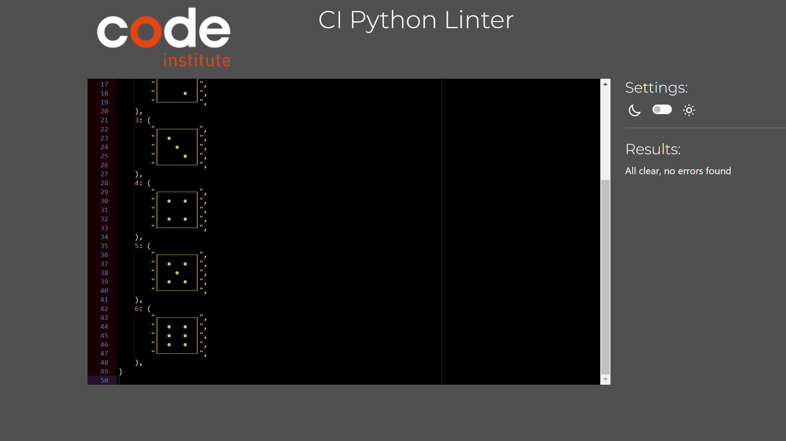

## Manual Testing

|Feature  |Expected Outcome| Testing Performed| Result| Pass/Fail|
| :--- | :---| :---| :---| :---|
| What is your name? | Logs name | Empty space, letters & numbers | It logs any input its given. | Pass |
| What is your age? | Accepts age or exits game if under 21 | Empty space, letters & numbers | It logs any age over 21, ends game for under 21 & gives a error invalid input. please enter a valid age | Pass
| Do you know how to play? | Takes you to the game or the instructions. | Empty space, letters & numbers | It only accpets 'y' or 'n' as an answer otherwise it prints "Please enter 'y' or 'n' try again" & repeats the question | Pass
| Do you want to start the game? | Starts the game or exits the game. | Empty space , letters & numbers | Any input that is not 'Y' or 'n' prints a error "Please enter 'y' or 'n'" & repeats the question | Pass
| Please use 'r' to roll your dice | Prints the dice at random & adds the score together. | Empty space, letters & numbers | Any input that is not 'r' prints a error "You have to enter 'r' to roll your dice try again" & repeats the question. | Pass
| Do you want to play again? 'y' or 'n' | Brings you back to roll the dice again or exits the game | Empty space, letters & numbers | Any input that is not 'Y' or 'n' prints a error "Please enter 'y' or 'n' try again" & repeats the question | Pass

# Bugs

* The game logic kept printing the same dice over and over again. - I had the varible in global scope and I never passed my function a argument.

* The game logic was not accepting a 7 as a lose condition after the first roll. - I had to restructure the elif/else statements and put them in order of importance.

* The game would not deploy to Heroku - I changed the name of my run.py file at the start so I had to change it back to solve this issue.

* When I entered a value that wasnt a number I got a traceback error - I used a try/except to repeat the code if the input is not a number.

## Remaining bugs

* No bugs remain

# Deployment

This project was deployed using Code Institutes mock terminal for Heroku.

* Steps for deployment.
* Fork or clone this repository.
* Create a new Heroku app.
* Set the build packs to `Python and Nodejs` in that order.
* Link the Heroku app to the repository.
* Click on **Deploy**.

# Credits

## Code Used

* For printing out the Dice to the terminal I used a line of code from [Bro Code's video](https://www.youtube.com/watch?v=x-Ag2_bJ40Y&t=308s) I also used the design for dice in the Dice_art.py
* I used [fsymbols](https://fsymbols.com/text-art/) for the ACSSI art in the introduction.

## Acknowledgments

* I would like to thank my mentor [Rory](https://github.com/Ri-Dearg) for all the help and guidance through out the Project.
* I would like to thank the Tutor support system for helping me when I was stuck or unsure.
* Code Instittute for the deployment terminal.
* [Tech with Tim](https://www.youtube.com/watch?v=u51Zjlnui4Y) for making a guide on using Colorama.
